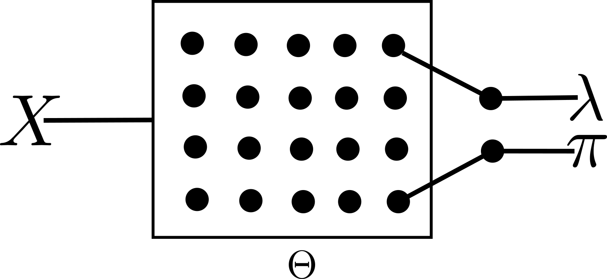
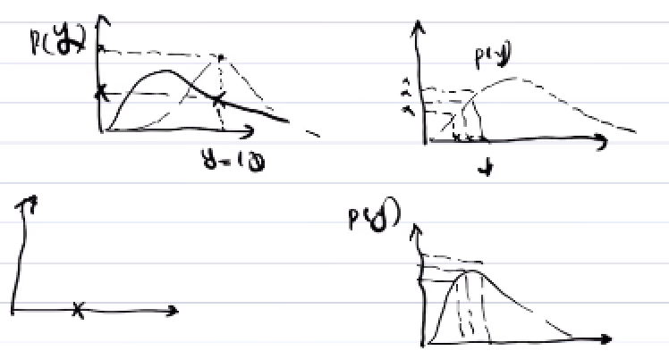

# Zero-inflated Poisson (ZIP) Regression

- Zero-inflated poisson model is a statistical model based on a zero-inflated probability distribution.
- ZIP distribution allows to model frequent zero-valued observations.
- ZIP model mixes two zero generating processes. 
	- The first process generates zeros. 
	- The second process is governed by a Poisson distribution that generates counts, some of which may be zero. 
- The mixture is described as follows:

$$Pr(Y=0) = \pi + (1-\pi)e^{-\lambda}$$

$$Pr(Y=y_i) = (1-\pi) \frac{\lambda^{y_i} e^{-\lambda}}{y_i!}, ~~~~y_i=1,2,3,\dots$$

 

- Here, 
	- $$\pi$$ - the probability of getting a zero (due to inflation) - due to zero inflation.
	- $$1-\pi$$ - the probability of getting a count (zero or > zero). 
	- When a 0 is observed, 
		- the 0 may come from the inflation (due to the properties of the observation) - the leftmost branch or 		 
		- the count may be a 0 (actual) - the left child of the right branch i.e., $$Pr(Y=0) = \frac{\lambda^0 e^{-\lambda} }{0!} = e^{-\lambda}$$ 
		- the count may be $$>0$$ - then the probality is given in the rightmost branch.

## ZIP model using NN
- From NN perspective, we are given with a set of $$N$$ observations $$(X, Y)$$. Our objective is to learn the parameters of the two distributions as functions of our input $$X$$,
	- $$\pi$$ for the Bernouli distribution generating zeros and 
	- $$\lambda$$ for the Poisson distribution generating the counts (including zeros)

- For a single instance $$X_i$$, the network outputs the probability of observing the corresponding count $$y_i$$: 

$$Pr(Y=y_i|\pi_i, \lambda_i)$$ 	

- Considering, $$\pi$$ and $$\lambda$$ are functions of network parameters, we get 

$$Pr(Y=y_i|\pi_i, \lambda_i) = Pr(Y=y_i|f_{\Theta}(X_i), g_{\Theta}(X_i))$$ 

- The log likelihood function for a single instance is given by,
	
	$$\log(Pr(Y=y_i|f_{\Theta}(X_i), g_{\Theta}(X_i)))$$
	
- The log likelihood of the entire dataset is given by,

$$\sum_{i=1}^N \log(Pr(Y=y_i|f_{\Theta}(X_i), g_{\Theta}(X_i)))$$

- The NN training will maximize this function with respect to $$\Theta$$:

$$\max_{\Theta} \sum_{i=1}^N \log(Pr(Y=y_i|f_{\Theta}(X_i), g_{\Theta}(X_i)))$$

 

## Loss function

- Traditinally, we get estimates of the outputs $$\hat y$$. The loss is the difference between the estimates and observations $$(\hat y - y)$$

- Here we are learning the distribution of $y$ i.e., $$Pr(Y)$$.

- For an observation, $$y_i$$, the probaility of observing, $$y_i$$ is 

$$\log Pr(Y=y_i) = \log Pr(Y=0) + \log Pr(Y=y_i)= \log (\pi + (1-\pi)e^{-\lambda}) + \log ((1-\pi) \frac{\lambda^{y_i} e^{-\lambda}}{y_i!}), ~~~~ y_i = 0,1,2,... $$

- W.r.t input $$X$$ and network parameters $$\Theta$$, the network outputs are:
	- O1: $$\log \lambda = 0_1 = \Theta * X$$ 
	- O2: $$logit (\pi) = O_2 = \frac{e^{\Theta * X}}{1+e^{\Theta * X}}$$

- **How to compute** $$Pr(Y=y | logit(\pi), log \lambda)$$? From the network outputs.

- If we observed 0 i.e., $$y_i = 0$$, the log likelihood is
	$$ll_{y_i=0} = \log(\pi + (1-\pi) e^{-\lambda} )$$ 
- If we observe $$y>0$$, then 
	$$ll_{y_i>0} = \log((1-\pi) \frac{\lambda^{y_i}e^{-\lambda}}{y_i!} )$$  	
- Total log loss is $$\sum_{i=1}{N} ll_{y_i}$$ 
- loss to minimize = - total log loss

## Getting the counts from learned parameters of the distributions (Sampling the distributions)

We need to compute, 
$$E[Pr(Y)] = \sum_{y=0}^\infty Pr(y_i) \times y_i$$

$$E[Pr(Y)] = \sum_{y=1}^\infty Pr(y_i) \times y_i$$

$$E[Pr(Y)] = \sum_{y=1}^\infty 
(1-\pi) \frac{\lambda^{y_i}e^{-\lambda}}{y_i!} \times y_i$$

$$E[Pr(Y)] = (1-\pi) \sum_{y=1}^\infty 
 \frac{\lambda^{y_i}e^{-\lambda}}{y_i!} \times y_i$$